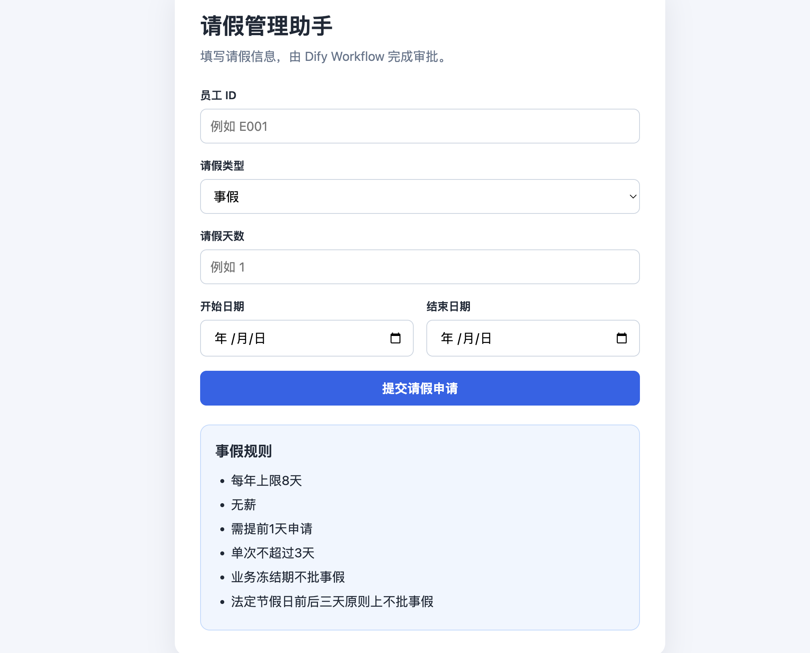
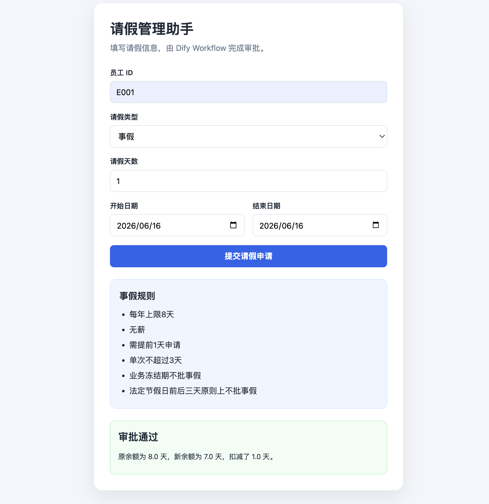
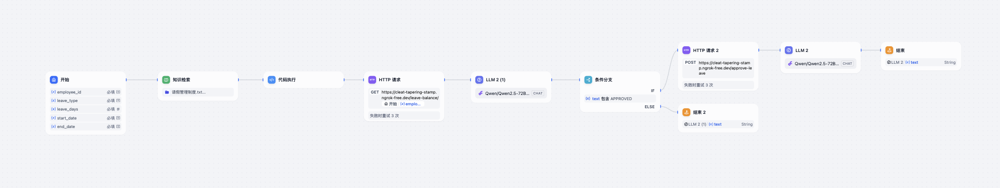

# AI Leave Management Assistant

An AI-powered leave management assistant built with Flask, SQLite, and Dify.

## Project Overview

This project simulates an intelligent employee leave approval system. It combines company leave policies, employee leave balances, and AI-assisted decision making to automatically evaluate leave requests and update leave records.

The system supports multiple leave types and provides automated leave balance management through a Flask backend and SQLite database.

## Features

* Employee leave balance query
* Annual leave management
* Sick leave management
* Personal leave management
* Automated leave approval workflow
* Automatic leave balance deduction
* SQLite database integration
* Dify AI workflow integration
* REST API support

## Tech Stack

* Python
* Flask
* SQLite
* HTML
* Dify
* Ngrok

## Project Structure

```text
leave-management-assistant/

├── app.py
├── server.py
├── frontend/
├── scripts/
├── data/
├── docs/
├── requirements.txt
└── database/
```

## Workflow

1. Employee submits a leave request.
2. The system checks leave balances and leave type.
3. Company leave policies are retrieved from the knowledge base.
4. The AI workflow evaluates the request.
5. Approved requests automatically deduct leave balances.
6. Results are stored in the database.

## Screenshots

### Leave Request Interface



### Approval Result



### Dify Workflow


## Example Functions

* Query employee leave balances
* Submit leave requests
* Automatic approval evaluation
* Leave balance updates
* Database record management

## Future Improvements

* Manager approval dashboard
* Leave history tracking
* User authentication
* Data visualization dashboard
* Email notification system

## Author

Hanyue Deng
